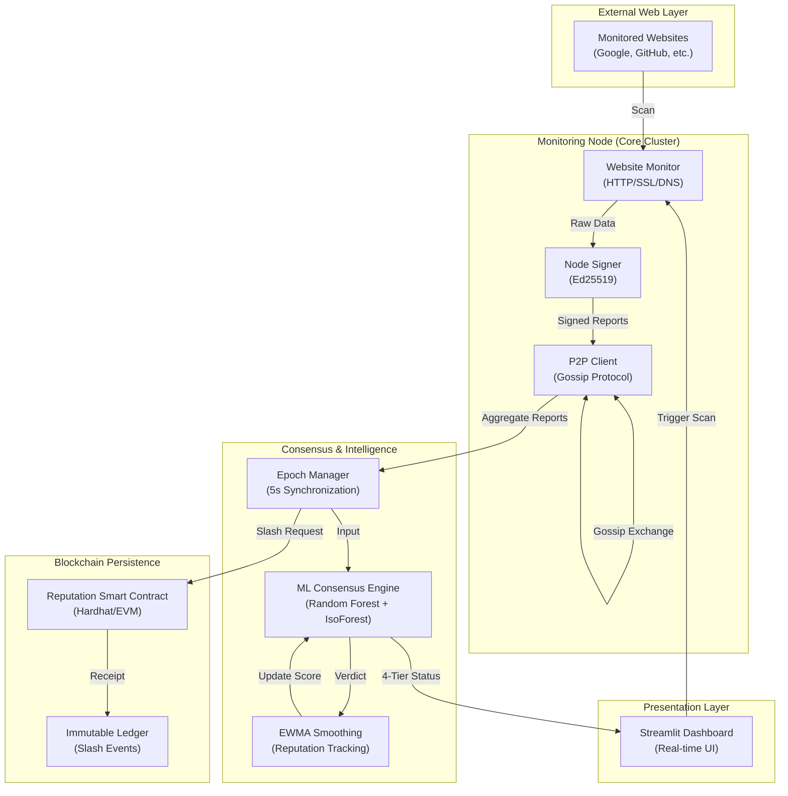

# System Architecture: Proof-of-Reputation Monitoring

This document provides a visual and structural overview of the end-to-end system flow.

## 1. End-to-End System Flow Diagram

## 2. Module Breakdown

### **Phase 1: Monitoring & Verification**
1.  **Website Monitor**: Uses `aiohttp` for high-concurrency scans. It verifies HTTP status codes, SSL certificate validity, and DNS resolution times.
2.  **Node Signer**: Every report is cryptographically signed using **Ed25519**. This ensures non-repudiation; a node cannot deny a report it has sent.

### **Phase 2: Communication (Gossip)**
3.  **P2P Client**: Instead of a central server, nodes talk to each other. We use a **Gossip Protocol with Fanout=3** to ensure that as the network grows to 50+ nodes, the bandwidth remains manageable.

### **Phase 3: Machine Learning Consensus**
4.  **Epoch Manager**: Every 5 seconds, the system "locks in" the current batch of reports.
5.  **ML Engine**:
    *   **Random Forest**: Categorizes normal vs. anomalous reporting patterns.
    *   **Isolation Forest**: Detects "outlier" nodes whose reports deviate significantly from the majority.
    *   **Vectorization**: The engine uses NumPy and Pandas to process hundreds of reports in milliseconds.

### **Phase 4: Mitigation & Settlement**
6.  **Mitigation Policy**: Nodes are assigned to 4 tiers: **Allow**, **Warn**, **Quarantine**, or **Slash**.
7.  **Smart Contract**: If a node is consistently malicious, the leader of the epoch sends a "Slash" transaction to the blockchain, permanently recording the penalty and reducing the node's stake.

### **Phase 5: Real-time Visualization**
8.  **Dashboard**: Connects to the local node APIs to show a unified view of network health, latencies, and the live reputation leaderboard.

---
*Generated: 2026-05-02*
