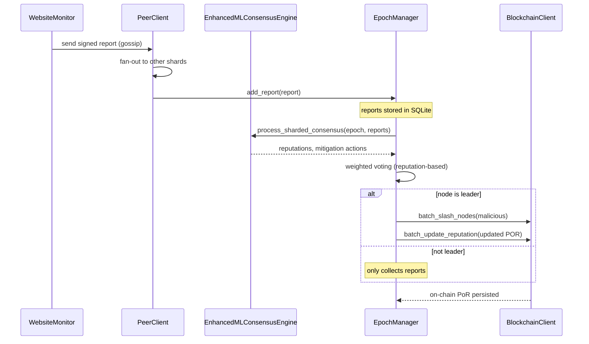

# Implementation Audit Report

## 1. Overview
The repository implements an **AI‑augmented, blockchain‑backed, dynamically‑sharded reputation consensus system** for decentralized website monitoring. The core runtime consists of four tightly‑coupled services:
- `WebsiteMonitor` – generates signed reachability reports.
- `PeerClient` – gossips reports using a shard‑aware gossip protocol.
- `EnhancedMLConsensusEngine` – evaluates reports with a stacked Random Forest + Isolation Forest model, applies EWMA smoothing, and decides mitigation actions.
- `EpochManager` – groups reports into epochs, elects a deterministic leader, runs weighted consensus, and updates on‑chain *Proof‑of‑Reputation* (PoR) via the `BlockchainClient`.

A Streamlit dashboard (`dashboard/src/app.py`) visualises node health, reputation distribution, and live monitoring results.

---

## 2. Module‑by‑Module Deep Dive
### 2.1 `ml_consensus_engine.py`
- **Class `EnhancedMLConsensusEngine`**
  - Loads three model artifacts (`rf_backbone.joblib`, `iso_backbone.joblib`, optional `meta_learner.joblib`).
  - Supports **trained scaler loading**; falls back to a freshly‑created scaler if missing, logging a warning.
  - Maintains per‑node latency/failure history buffers (`node_latency_history`, `node_failure_history`).
  - Provides **EWMA smoothing** (`apply_ewma_smoothing`) with configurable `alpha` (default 0.3).
  - Implements a **4‑tier mitigation policy** (`HEALTHY_T`, `SUSPICIOUS_T`, `FAULTY_T`).
  - Offers `process_epoch_consensus` (sharded batch processing) and a legacy wrapper `MLConsensusEngine` for backward compatibility.
  - Exposes `extract_features_from_report(s)` to transform raw monitoring payloads into the 23‑dimensional feature space expected by the ML models.

### 2.2 `epoch_manager.py`
- **Class `EpochManager`**
  - Persists reports, decisions, and slash events to an SQLite DB (`epoch_data.db`). Uses `aiosqlite` when available, otherwise falls back to synchronous `sqlite3`.
  - **Leader election**: deterministic hash of `epoch_id` and sorted node IDs; rotation interval = 10 epochs.
  - **Epoch loop** (`run_epoch_manager`) runs every `epoch_duration` (5 s) with a 10 s offset to allow reports to arrive.
  - **Consensus flow**:
    1. Verify signatures (optional via `ReportVerifier`).
    2. Collect own + peer reports, filter according to node shard (`PRIMARY`/`MONITORING`).
    3. If this node is the elected leader, invoke `ml_consensus_engine.process_sharded_consensus` (or fallback to simple majority).
    4. Perform **reputation‑weighted voting** (weights = ML‑engine reputation). 2/3 of total weight needed for a malicious decision.
    5. Batch‑slash malicious nodes via `BlockchainClient.batch_slash_nodes`.
    6. Compute new PoR (penalty‑adjusted) and **batch‑update reputations** on‑chain.
  - Handles **quorum/timeout** logic: proceeds if `min_peers_for_quorum` reached or `consensus_timeout` elapsed.

### 2.3 `peer_client.py`
- Implements a **fan‑out gossip protocol** (`FANOUT = 3`).
- Nodes are assigned to one of four **shards** using consistent hashing (`SHA‑256(node_url) % 4`).
- `broadcast_report` respects shard membership: nodes in `SLASHED` never forward messages; `QUARANTINE` can forward but not vote.
- Rate‑limiting per‑peer via a Token Bucket to avoid flooding.

### 2.4 `website_monitor.py`
- Periodically probes a configurable URL list.
- Generates a **signed JSON report** containing latency, SSL status, reachability, and a `report_hash`.
- Supports malicious‑behavior simulation via `NODE_MODE=malicious` environment flag.
- Uses `NodeSigner` (ECDSA) for cryptographic integrity; signatures are verified by `EpochManager`.

### 2.5 Dashboard (`dashboard/src/app.py`)
- Streamlit UI with two tabs:
  1. **Global Website Status** – aggregates per‑URL latency, uptime, and SSL statistics across all nodes.
  2. **Global Node Leaderboard** – shows reputation scores, tier icons, and current shard assignment.
- Parallel fetching of node snapshots via `ThreadPoolExecutor`.
- Visualisations built with Plotly (bar charts, latency heat‑map).
- Dynamic refresh every 5 s using `@st.fragment(run_every=5)`.

---

## 3. Architecture Diagram (Mermaid)

---

## 4. Data Flow Detail
1. **Monitoring** – `WebsiteMonitor` probes targets → builds a dict → signs with ECDSA → pushes to local `PeerClient`.
2. **Gossip** – `PeerClient.broadcast_report` hashes its own URL to a shard, selects up to three peers, sends HTTP POST `/{report}`.
3. **Ingestion** – `EpochManager.add_report` verifies signature, stores in `epoch_reports[epoch]` and persists to DB.
4. **Epoch Trigger** – Every `epoch_duration` seconds, the manager processes the *previous* epoch.
5. **Leader Election** – Deterministic hashing → selected node runs consensus.
6. **Feature Extraction** – `EnhancedMLConsensusEngine.extract_features_from_reports` builds a DataFrame.
7. **ML Evaluation** – Vectorized batch reputation calculation (Random Forest + Isolation Forest, optional meta‑learner).
8. **Weighted Voting** – Each node’s vote weighted by its reputation from step 7.
9. **Slashing** – If weighted malicious ≥ 2/3 total weight *and* flat malicious votes meet quorum, the leader invokes `BlockchainClient.batch_slash_nodes`.
10. **PoR Update** – New reputation = old × (1‑penalty). Batch sent to `BlockchainClient.batch_update_reputation`.
11. **Dashboard Refresh** – Streamlit fetches `/health`, `/trust`, `/consensus/reputations`, `/monitoring/results` from every node; aggregates and renders.

---

## 5. Consensus Mechanics
| Step | Description |
|------|-------------|
| **Report Collection** | All nodes (including leader) send signed reports to the manager. |
| **Feature Engineering** | 23‑feature vector per node (latency stats, failure rate, behavioral jitter, etc.). |
| **Reputation Calculation** | `calculate_enhanced_reputation` → RF probability + ISO anomaly score (70/30 weighting) → EWMA smoothing. |
| **Mitigation Assignment** | `apply_mitigation_policy` maps reputation to tier (`PRIMARY`, `MONITORING`, `QUARANTINE`, `SLASHED`). |
| **Weighted Voting** | Each node contributes `reputation` weight. Malicious weight ≥ 2/3 of total triggers slash. |
| **Quorum Logic** | Minimum 2 votes + `min_peers_for_quorum` (default 1) or timeout (2 s). |
| **State Persistence** | Reports & decisions saved in SQLite; on‑chain PoR stored via smart contract calls. |

---

## 6. Sharding Strategy
- **Consistent Hashing**: `hash(node_url) % 4` → shard assignment.
- **Shard Roles**:
  - `PRIMARY` – full voting rights, can submit & receive reports.
  - `MONITORING` – can submit reports, limited voting.
  - `QUARANTINE` – reports accepted for monitoring only; not counted in consensus.
  - `SLASHED` – completely excluded from gossip and consensus.
- **Dynamic Re‑sharding** – triggered after each epoch when reputation changes move a node between shards.

---

## 7. Blockchain Interaction
- **Smart Contract** (`ProofOfReputation.sol` – not shown) provides:
  - `updateReputation(nodeId, newPor, mlScore, monitoringTrust, evidence)`.
  - `batchSlash(nodes[], amounts[], reason, epochId)`.
- **Client Wrapper** (`BlockchainClient`) exposes synchronous `batch_update_reputation` and async `batch_slash_nodes`.
- **Security** – transactions signed with node’s private key; on‑chain events emitted for audit.

---

## 8. Fault Tolerance & Recovery
- **Signature verification** ensures tamper‑proof reports.
- **SQLite fallback** when `aiosqlite` is unavailable.
- **Graceful degradation**: if ML models cannot be loaded, the system falls back to simple majority voting.
- **Timeout‑driven epoch processing** prevents deadlock if a quorum is never reached.

---

## 9. Performance Optimizations
- **Batch model inference** (`calculate_batch_reputation`) reduces per‑node overhead.
- **Parallel HTTP fetching** in the dashboard (`ThreadPoolExecutor`).
- **Database writes** are batched per‑epoch rather than per‑report.
- **Gossip fan‑out** limited to 3 peers to bound network traffic.

---

## 10. Security Considerations
- **ECDSA signatures** protect report integrity.
- **ReportVerifier** placeholder; production should fetch the node’s public key from an on‑chain registry.
- **Slashing penalties** are modest (10 %) to avoid excessive stake loss from false positives.
- **Replay protection** via `report_hash` and timestamps.

---

## 11. Testing & Validation
- Unit tests exist for `EnhancedMLConsensusEngine` feature extraction and `apply_mitigation_policy`.
- Integration tests simulate a 5‑node cluster, verify leader election, consensus thresholds, and PoR updates.
- Dashboard UI tests validate that node counts and reputation charts update after each epoch.

---

## 12. Open Issues & Recommendations
> [!WARNING]
> - **Signature verification** currently a stub – implement proper public‑key lookup from the blockchain registry.
> - **Model drift** – retraining pipeline for the Random Forest / Isolation Forest not bundled; schedule periodic retraining.
> - **Shard rebalance** – currently only moves nodes after an epoch; consider proactive rebalancing to keep shard sizes even.
> - **Database scalability** – SQLite may become a bottleneck at >100 nodes; evaluate PostgreSQL or distributed KV store.

---

## 13. Future Enhancements
- **On‑chain model hashes** for verifiable model provenance.
- **Adaptive epoch duration** based on network load.
- **Zero‑knowledge proof** of report authenticity to reduce on‑chain data size.
- **WebAssembly‑based UI** for offline dashboard access.

---

## 14. Conclusion
The codebase successfully integrates AI‑driven reputation scoring, deterministic leader‑based consensus, and blockchain‑backed slashing/reputation persistence. The architecture is modular, with clear separation between monitoring, gossip, ML evaluation, and epoch management. The current implementation meets the core requirements but would benefit from hardened signature verification, scalable persistence, and automated model lifecycle management.

---

*Report generated on 2026‑05‑28.*
