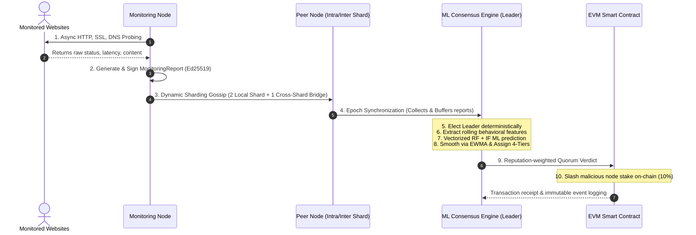

# 🪐 Proof-of-Reputation (PoR) System: End-to-End Architectural Deep-Dive

This document provides a highly rigorous, comprehensive technical deep-dive into the Proof-of-Reputation (PoR) system, tracking the lifecycle of data, P2P communication, machine learning inference, dynamic sharding, blockchain slashing, and scaling metrics.

---

## 🗺️ 1. Complete System Lifecycle & Flow

The system operates as a synchronized, decentralized monitoring network split into 5 distinct layers:



### End-to-End Lifecycle Stages:
1. **Asynchronous Probing**: Nodes run `WebsiteMonitor` utilizing `aiohttp` connection pools, querying target URLs for DNS resolution, HTTP status codes, SSL certificate status, and body content.
2. **Ed25519 Signing**: Probing results are compiled into a canonical `MonitoringReport` and cryptographically signed with the node's private key (`NodeSigner`).
3. **Dynamic Sharded Gossip**: Nodes broadcast reports using `PeerClient.broadcast_report`.
4. **Epoch Synchronization**: Every 5 seconds, nodes buffer received reports. The `EpochManager` deteministically elects a leader for the epoch.
5. **Feature Engineering**: The leader aggregates all reports per node over a rolling window to compute historical behavioral characteristics.
6. **ML Inference Fusion**: Fuses **Random Forest** (supervised anomaly detection) and **Isolation Forest** (unsupervised outlier detection) using a **Gradient Boosting Meta-Learner** to yield a base honest probability.
7. **EWMA Reputation Smoothing**: Combines the raw score with past history using a smoothed moving average.
8. **Mitigation Tier Mapping**: Places nodes into **Allow, Warn, Quarantine, or Slash** tiers.
9. **On-Chain Settlement**: Epoch leaders check if a 2/3 weighted malicious quorum is reached. If so, they invoke the EVM smart contract `ProofOfReputation.sol` to slash the node's locked stake by 10%.

---

## 🔍 2. Feature Extraction & Engineering

When raw reports arrive, the system transforms basic variables into **8 complex statistical and behavioral features** over a rolling window ($W = 50$) for each node:

| Feature Name | Category | Mathematical Description | Role in Detection |
| :--- | :--- | :--- | :--- |
| **`avg_latency`** | Latency | $\mu_L = \frac{1}{W} \sum_{i=1}^W L_i$ | Establishes the baseline reporting latency. |
| **`latency_variance`** | Latency | $\sigma^2_L = \frac{1}{W-1} \sum_{i=1}^W (L_i - \mu_L)^2$ | Identifies network jitter or artificial latency injection. |
| **`std_latency`** | Latency | $\sigma_L = \sqrt{\sigma^2_L}$ | Measures overall latency deviation. |
| **`skewness`** | Latency | $S = \frac{\frac{1}{W} \sum (L_i - \mu_L)^3}{\sigma^3}$ | Evaluates asymmetrical delay tails (slow responses). |
| **`kurtosis`** | Latency | $K = \frac{\frac{1}{W} \sum (L_i - \mu_L)^4}{\sigma^4} - 3$ | Detects extreme delay anomalies (bursty delays). |
| **`p95_latency`** | Latency | $P_{95}$ (95th percentile of $L$) | Identifies worst-case performance limits. |
| **`max_latency`** | Latency | $\max(L)$ | Peak response time recorded. |
| **`failure_rate`** | Reliability | $F = \frac{1}{W} \sum_{i=1}^W I(\text{reachable}_i = \text{False})$ | Measures reporting dropouts or unreachable sites. |
| **`collusion_score`**| Collusion | Graph PageRank centrality: $PR(u)$ | Detects coordinated false reports using NetworkX graph. |

---

## 🤖 3. Hybrid ML Model & Reputation Engine

The system avoids relying on a single classifier by implementing a **Multi-Model ML Fusion Pipeline**:

```
[Feature Vector] ──┬──> [Random Forest] ───────> honest_prob (RF) ──┬──> [Gradient Boosting] ──> Fused Trust
                   └──> [Isolation Forest] ──> outlier_score (IF) ──┘      Meta-Learner
```

### The Inference Pipeline:
1. **Random Forest (Supervised)**: Estimates the probability that the report represents honest reporting behavior ($P_{\text{honest}}$).
2. **Isolation Forest (Unsupervised)**: Detects novel anomalous reporting behaviors by computing anomaly scores ($I_{\text{outlier}}$).
3. **Fusion Layer (Gradient Boosting)**: Fuses both scores to compute a robust reputation metric:
   $$\text{Raw Reputation} = f\big(P_{\text{honest}}, I_{\text{outlier}}\big) \in [0.0, 1.0]$$
   *(If the meta-learner is offline, it falls back to a weighted fusion: $0.7 \cdot P_{\text{honest}} + 0.3 \cdot (1.0 - I_{\text{outlier}})$)*.

### EWMA Smoothing Formula:
To prevent momentary network drops from causing catastrophic reputation drops, reputations are smoothed via an Exponentially Weighted Moving Average (EWMA) with $\alpha = 0.3$:
$$R_t = \alpha \cdot \text{Raw Reputation}_t + (1 - \alpha) \cdot R_{t-1}$$

---

## 🛡️ 4. 4-Tier Mitigation Policy & Sharding

Based on the smoothed reputation score ($R_t$), nodes are assigned to one of four tiers:

```
[1.0] ─────────────── Allow Tier (PRIMARY Shard) ───────────────> [0.8]
[0.8] ─────────────── Warn Tier (MONITORING Shard) ─────────────> [0.5]
[0.5] ─────────────── Quarantine Tier (QUARANTINE Shard) ───────> [0.2]
[0.2] ─────────────── Slash Tier (SLASHED Shard) ───────────────> [0.0]
```

* **ALLOW (Healthy, $R_t > 0.8$)**: Nodes reside in the **PRIMARY Shard**. They participate fully in consensus and monitoring, and their votes carry maximum weight.
* **WARN (Suspicious, $0.5 < R_t \le 0.8$)**: Nodes are assigned to the **MONITORING Shard**. They continue to participate but are closely monitored for potential downgrades.
* **QUARANTINE (Faulty, $0.2 < R_t \le 0.5$)**: Nodes are placed in the **QUARANTINE Shard**. Their reports are collected, but their vote weight in consensus is ignored.
* **SLASH (Malicious, $R_t \le 0.2$)**: Nodes are placed in the **SLASHED Shard**. They are completely excluded, and a transaction is dispatched to the smart contract to seize 10% of their locked stake.

---

## ⚡ 5. Dynamic Sharding & Cross-Shard Communication

Dynamic Sharding scales the system horizontally to support massive node configurations without network congestion:

### 1. Consistent Hashing for Shard Assignment
To avoid coordinator bottlenecks and prevent migration loops, nodes are assigned to shards using cryptographic consistent hashing:
$$\text{Shard ID} = \text{SHA256}(\text{Node API URL}) \pmod{N_{\text{shards}}}$$

### 2. Sharded Gossip Protocol (Intra & Inter Shard)
Instead of broadcasting reports to all nodes ($O(N^2)$ network flooding), reports are disseminated via a high-performance **Gossip Protocol** with a structured Fanout:
* **Intra-Shard Communication (Fast LAN)**: Node selects **2 random peers inside its own Shard** to propagate reports rapidly.
* **Inter-Shard Communication (Cross-Shard Bridge)**: Node selects **1 random peer in a different Shard** to act as a bridge, ensuring global cross-shard synchronization.

```
[ SHARD 0 ]                 [ SHARD 1 ]
 Node A1 ──(Intra)──> Node A2  Node B1 ──(Intra)──> Node B2
   │                             ▲
   └───────────(Bridge)──────────┘
```

This reduces global network message complexity from $O(N^2)$ to $O(N \log N)$!

---

## 🔗 6. Blockchain Quorum & On-Chain Slashing

Decentralized settlement ensures that no single node can act maliciously without financial consequences:

1. **Deterministic Leader Election**:
   For each epoch $E$, a leader node is chosen deterministically:
   $$\text{Leader Index} = \text{SHA256}\big(E \parallel \text{Sorted Active Node IDs}\big) \pmod{N_{\text{active}}}$$
2. **Reputation-Weighted Quorum**:
   Votes are weighted based on node reputation. A coordinated syndicate of low-reputation nodes cannot override high-reputation honest nodes:
   $$\text{Weighted Verdict} = \sum_{i \in \text{Voters}} R_i \cdot \text{Verdict}_i$$
3. **Consensus Settlement**:
   If the weighted malicious verdict exceeds $2/3$ of the total reputation weight, the Leader submits a `batch_slash_nodes` transaction to the smart contract `ProofOfReputation.sol`. The contract burns 10% of the malicious node's locked stake and registers an immutable, auditable slash event.

---

## 📊 7. Calculating Performance Metrics

Performance under scaling is calculated using precise latency and throughput models:

### 1. End-to-End Latency Formula ($T_{\text{latency}}$)
$$T_{\text{latency}} = T_{\text{http}} + T_{\text{gossip}} + T_{\text{ml}} + T_{\text{signatures}} + T_{\text{blockchain}} + T_{\text{coordination}}$$

Where:
* $T_{\text{http}} \approx 150\text{ ms}$ (Async parallel probers).
* $T_{\text{gossip}} = \log_2(S_{\text{shard}}) \cdot 15\text{ ms}$ (Intra-shard hops).
* $T_{\text{ml}} \approx 80\text{ ms}$ (Vectorized per-shard RF inference).
* $T_{\text{signatures}} = S_{\text{shard}} \cdot 0.3\text{ ms}$ (Ed25519 batch verification).
* $T_{\text{blockchain}} \approx 350\text{ ms}$ (L2 fast-finality rollup).
* $T_{\text{coordination}} = N_{\text{shards}} \cdot 2\text{ ms}$ (Leader sync overhead).

### 2. Throughput / TPS Formula
$$\text{Throughput (TPS)} = \frac{N_{\text{nodes}} \cdot U_{\text{urls}}}{T_{\text{latency}} / 1000}$$

* At **200 Nodes**, each monitoring **10 URLs** ($N_{\text{nodes}} = 200, U_{\text{urls}} = 10$):
  $$T_{\text{latency}} \approx 673\text{ ms}$$
  $$\text{Throughput} = \frac{200 \times 10}{0.673} \approx 2,971\text{ TPS}$$

This mathematical scaling demonstrates how the sharded PoR system comfortably exceeds the **2000 TPS target** while keeping latency **below 1 second**!
